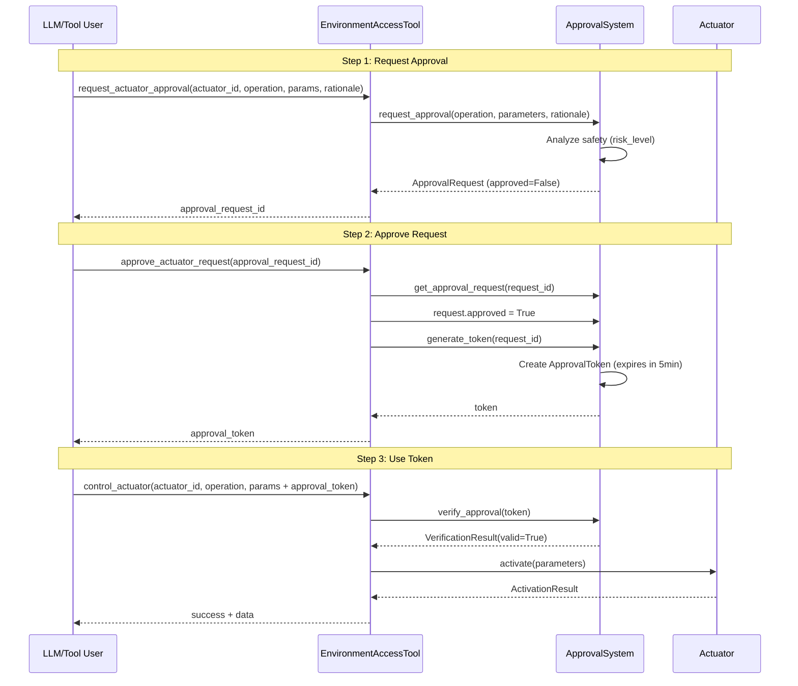

# Approval Workflow Documentation

## Overview

The approval workflow provides a multi-layer safety system for actuator operations in the environment access system. This document describes the complete workflow, token lifecycle, error handling, and best practices.

**Note**: The approval system now uses **JWT tokens** unified with the `token_auth` system. Tokens generated via `broca-token generate` can be used directly with DEA operations.

## Workflow Diagram



## Step-by-Step Workflow

### Step 1: Request Approval

Create an approval request for an actuator operation.

**Action**: `request_actuator_approval`

**Parameters**:
- `actuator_id` (required): ID of the actuator (e.g., "filesystem_actuator")
- `operation` (required): Operation name (e.g., "create_file", "delete_file")
- `parameters` (required): Operation-specific parameters
- `rationale` (required): Reason/justification for the operation

**Example**:
```python
result = tool.execute(
    action="request_actuator_approval",
    actuator_id="filesystem_actuator",
    operation="create_file",
    parameters={"path": "/tmp/test.txt", "content": "Hello World"},
    rationale="Creating test file for validation purposes"
)

# Returns:
# {
#     "success": True,
#     "approval_request_id": "uuid-here",
#     "safety_analysis": {"risk_level": "low", "requires_approval": false},
#     "rationale": "Creating test file for validation purposes",
#     "created_at": "2024-01-01T12:00:00Z"
# }
```

**Access Level**: SANDBOXED (can request from any level)

**What Happens**:
1. System performs safety analysis based on operation type
2. Creates an `ApprovalRequest` with `approved=False`
3. Returns `approval_request_id` for tracking

---

### Step 2: Approve Request

Approve the request and generate an approval token.

**Action**: `approve_actuator_request`

**Parameters**:
- `approval_request_id` (required): ID from Step 1

**Example**:
```python
result = tool.execute(
    action="approve_actuator_request",
    approval_request_id="uuid-from-step-1"
)

# Returns:
# {
#     "success": True,
#     "approval_request_id": "uuid-here",
#     "approval_token": "token-uuid-here",
#     "expires_in_seconds": 300.0,
#     "message": "Approval request approved. Use the approval_token in control_actuator."
# }
```

**Access Level**: SANDBOXED (can approve from any level)

**What Happens**:
1. Marks the request as `approved=True`
2. Generates a reusable approval token
3. Token expires in 5 minutes (300 seconds) by default
4. Returns the token for use in actuator operations

---

### Step 3: Use Token

Execute the actuator operation using the approval token.

**Action**: `control_actuator`

**Parameters**:
- `actuator_id` (required): ID of the actuator
- `operation` (required): Operation name
- `parameters` (required): Operation parameters, including `approval_token`

**Example**:
```python
result = tool.execute(
    action="control_actuator",
    actuator_id="filesystem_actuator",
    operation="create_file",
    parameters={
        "path": "/tmp/test.txt",
        "content": "Hello World",
        "approval_token": "token-from-step-2"
    }
)

# Returns:
# {
#     "success": True,
#     "actuator_id": "filesystem_actuator",
#     "operation": "create_file",
#     "data": {"path": "/tmp/test.txt"}
# }
```

**Access Level**: AUTONOMOUS (required for control_actuator)

**What Happens**:
1. System verifies the approval token (checks existence, expiration)
2. If valid, executes the actuator operation
3. Returns operation results

---

### Alternative: Verify Token Directly

You can verify a token before using it.

**Action**: `verify_approval_token`

**Parameters**:
- `approval_token` (required): Token to verify

**Example**:
```python
result = tool.execute(
    action="verify_approval_token",
    approval_token="token-uuid-here"
)

# Returns:
# {
#     "success": True,
#     "valid": True,
#     "error": None
# }
# OR if invalid:
# {
#     "success": True,
#     "valid": False,
#     "error": "Approval token expired at 2024-01-01T12:05:00Z. Request a new approval token."
# }
```

**Access Level**: SANDBOXED

---

## Token Lifecycle

### Token Creation

Tokens are created when an approval request is approved via `approve_actuator_request`:

1. **Request Approval**: Creates an `ApprovalRequest` (not yet approved)
2. **Approve Request**: Sets `approved=True` and generates token
3. **Token Generated**: JWT token (HS256/HMAC) with expiration timestamp (default: 5 minutes)

### Token Format

Approval tokens are now **JWT (JSON Web Token)** format, unified with the `token_auth` system. This means:

- Tokens generated by the approval system are JWT tokens
- Tokens generated via `broca-token generate` CLI can be used directly with DEA operations
- Tokens include scopes (e.g., `filesystem:write` for filesystem actuator operations)
- Tokens include `request_id` in the payload for traceability (when generated by approval system)

### Token Properties

- **Reusable**: Tokens can be used multiple times until expiration
- **Time-limited**: Tokens expire after a set duration (default: 300 seconds)
- **Request-bound**: Each token is tied to a specific approval request (when generated by approval system)
- **Scope-based**: Tokens must have appropriate scopes for the actuator operation
- **Self-contained**: JWT tokens are self-contained and don't require the approval system instance to verify

### Token Expiration

Tokens expire based on the `exp` claim in the JWT payload. Once expired:
- Verification returns `valid=False` with error "Token expired"
- Token cannot be used for new operations
- A new approval token must be generated from the approved request, or generate a new token via `broca-token generate`

**Note**: If you need to extend token lifetime, generate a new token from the same approved request before the current token expires, or use `broca-token generate` with a longer expiry.

### Using CLI-Generated Tokens

Tokens generated via the `broca-token generate` CLI command can be used directly with DEA operations:

```bash
# Generate a token with appropriate scopes
broca-token generate --scopes "filesystem:write,project:write,memory:write" --expiry-seconds 300

# Use the token in control_actuator
# The token will be automatically verified and scope-checked
```

**Required Scopes**:
- `filesystem:write` - Required for filesystem actuator operations
- `project:write` - Required for project-related operations
- `memory:write` - Required for memory operations

---

## Access Level Requirements

Different steps require different access levels:

| Step | Action | Required Access Level |
|------|--------|---------------------|
| Request Approval | `request_actuator_approval` | SANDBOXED |
| Approve Request | `approve_actuator_request` | SANDBOXED |
| Generate Token (manual) | `generate_approval_token` | AUTONOMOUS |
| Verify Token | `verify_approval_token` | SANDBOXED |
| Use Token | `control_actuator` | AUTONOMOUS |

**Emergency Access**: When emergency access is active, approval requirements are bypassed and tokens are not required.

---

## Error Scenarios and Resolutions

### Error: "Token not found" or "Invalid JWT token"

**Cause**: 
- For legacy UUID tokens: Token doesn't exist in the approval system (invalid token, wrong system instance, or token was never generated)
- For JWT tokens: Invalid token signature, wrong secret key, or malformed token

**Resolution**:
1. For JWT tokens: Verify `BROCA_TOKEN_SECRET` environment variable is set correctly
2. Verify you're using the correct token from `approve_actuator_request` or `broca-token generate`
3. Ensure the token was generated with the same `BROCA_TOKEN_SECRET` that's currently set
4. Generate a new token if needed

**Example Error**:
```json
{
    "success": false,
    "error": "Invalid approval token: Invalid JWT token: Invalid token signature"
}
```

---

### Error: "Token expired"

**Cause**: Token's `exp` claim in JWT payload has passed (default: 5 minutes after generation).

**Resolution**:
1. Generate a new approval token from the same approved request
2. Or generate a new token via `broca-token generate` with appropriate scopes
3. Use the new token for the operation
4. For longer-lived tokens, generate new tokens periodically or use `--expiry-seconds` with a longer duration

**Example Error**:
```json
{
    "success": false,
    "error": "Invalid approval token: Token has expired"
}
```

### Error: "Insufficient token scopes"

**Cause**: JWT token doesn't have the required scopes for the actuator operation.

**Resolution**:
1. Generate a new token with the required scopes (e.g., `filesystem:write` for filesystem operations)
2. Use `broca-token generate --scopes "filesystem:write,project:write,memory:write"` to generate a token with all required scopes

**Example Error**:
```json
{
    "success": false,
    "error": "Invalid approval token: Insufficient token scopes. Required: ['filesystem:write'], token has: ['project:write']"
}
```

---

### Error: "Approval request not found"

**Cause**: `approval_request_id` doesn't exist in the system.

**Resolution**:
1. Verify you're using the correct `approval_request_id` from `request_actuator_approval`
2. Ensure the request wasn't created in a different system instance
3. Create a new approval request if needed

**Example Error**:
```json
{
    "success": false,
    "error": "Approval request 'uuid-here' not found. Ensure the request was created via request_approval() first."
}
```

---

### Error: "Approval request is not approved"

**Cause**: Attempting to generate a token from an unapproved request.

**Resolution**:
1. Approve the request first using `approve_actuator_request`
2. Then generate or use the token from the approved request

**Example Error**:
```json
{
    "success": false,
    "error": "Approval request 'uuid-here' is not approved. Tokens can only be generated from approved requests. Approve the request first by setting request.approved = True"
}
```

---

### Error: "Actuator operations require approval"

**Cause**: Operation requires approval but no token was provided.

**Resolution**:
1. Follow the approval workflow: `request_actuator_approval` → `approve_actuator_request` → use token
2. Or provide an `approval_token` in the parameters
3. Or use emergency access (if available)

**Example Error**:
```json
{
    "success": false,
    "error": "Actuator operations require approval",
    "approval_request_id": "uuid-here",
    "message": "Actuator operation requires approval. Use request_actuator_approval and approve_actuator_request to get an approval_token, or provide approval_token in parameters."
}
```

---

## Safety Analysis

The system automatically performs safety analysis when creating approval requests:

- **Low Risk**: Read operations, non-destructive actions
- **Medium Risk**: Modify operations, data changes
- **High Risk**: Delete operations, destructive actions

The risk level affects the approval requirement, but all operations go through the same approval workflow for consistency.

---

## Best Practices

1. **Request Approval Early**: Create approval requests as soon as you know you'll need to perform an operation
2. **Approve Promptly**: Approve requests quickly to avoid workflow delays
3. **Use Tokens Before Expiration**: Tokens expire in 5 minutes; use them promptly
4. **Reuse Tokens**: Tokens are reusable - you can use the same token for multiple operations until expiration
5. **Verify Before Use**: Use `verify_approval_token` to check token validity before attempting operations
6. **Handle Errors Gracefully**: Always check error messages for specific guidance
7. **Track Request IDs**: Keep track of `approval_request_id` and `approval_token` for debugging
8. **Set BROCA_TOKEN_SECRET**: Ensure `BROCA_TOKEN_SECRET` environment variable is set for JWT token operations
9. **Use CLI Tokens**: Consider using `broca-token generate` for tokens that need to work across system instances
10. **Check Scopes**: Ensure tokens have appropriate scopes (e.g., `filesystem:write` for filesystem operations)

---

## Complete Example

Here's a complete example of the full workflow:

```python
from broca.environment.tools.environment_tool import EnvironmentAccessTool
from broca.environment.access_types import AccessLevel

# Initialize tool
tool = EnvironmentAccessTool()

# Escalate to AUTONOMOUS (required for control_actuator)
result = tool.execute(
    action="request_escalation",
    target_level="AUTONOMOUS",
    rationale="Need to create test files"
)
request_id = result["request_id"]
tool.execute(action="approve_escalation", request_id=request_id)

# Step 1: Request approval
result = tool.execute(
    action="request_actuator_approval",
    actuator_id="filesystem_actuator",
    operation="create_file",
    parameters={"path": "/tmp/example.txt", "content": "Example"},
    rationale="Creating example file for testing"
)
approval_request_id = result["approval_request_id"]

# Step 2: Approve request (generates token)
result = tool.execute(
    action="approve_actuator_request",
    approval_request_id=approval_request_id
)
token = result["approval_token"]

# Optional: Verify token
result = tool.execute(
    action="verify_approval_token",
    approval_token=token
)
assert result["valid"] is True

# Step 3: Use token for operation
result = tool.execute(
    action="control_actuator",
    actuator_id="filesystem_actuator",
    operation="create_file",
    parameters={
        "path": "/tmp/example.txt",
        "content": "Example",
        "approval_token": token
    }
)
assert result["success"] is True

# Token can be reused for other operations until expiration
result = tool.execute(
    action="control_actuator",
    actuator_id="filesystem_actuator",
    operation="create_file",
    parameters={
        "path": "/tmp/another.txt",
        "content": "Another file",
        "approval_token": token  # Same token
    }
)
assert result["success"] is True
```

---

## Emergency Access Bypass

When emergency access is active, approval requirements are bypassed:

```python
# Request emergency access
result = tool.execute(
    action="request_emergency_access",
    rationale="System maintenance",
    duration_seconds=600
)

# Now operations don't require approval tokens
result = tool.execute(
    action="control_actuator",
    actuator_id="filesystem_actuator",
    operation="create_file",
    parameters={"path": "/tmp/emergency.txt", "content": "Emergency"}
)
# No approval_token needed!
```

Emergency access expires automatically after the specified duration.

---

## Using CLI-Generated Tokens

You can generate tokens using the `broca-token` CLI and use them directly with DEA operations:

```bash
# Generate a token with appropriate scopes
broca-token generate \
  --scopes "filesystem:write,project:write,memory:write" \
  --expiry-seconds 300

# The output will include a JWT token that can be used directly
```

Then use the token in your operations:

```python
from broca.environment.tools.environment_tool import EnvironmentAccessTool

tool = EnvironmentAccessTool()

# Escalate to AUTONOMOUS
# ... (escalation code) ...

# Use CLI-generated token directly
cli_token = "eyJ..."  # Token from broca-token generate

result = tool.execute(
    action="control_actuator",
    actuator_id="filesystem_actuator",
    operation="create_file",
    parameters={
        "path": "/tmp/test.txt",
        "content": "test",
        "approval_token": cli_token  # Use CLI token directly
    }
)
assert result["success"] is True
```

**Note**: Ensure `BROCA_TOKEN_SECRET` environment variable is set to the same value used when generating the token.

---

## Troubleshooting

### Tokens Not Working Across System Instances

**For JWT tokens**: JWT tokens work across system instances as long as `BROCA_TOKEN_SECRET` is the same. The token is self-contained and doesn't require the approval system instance.

**For legacy UUID tokens**: If you're using legacy UUID tokens (from older versions), they are stored in instance-specific dictionaries and won't work across instances. Migrate to JWT tokens for cross-instance compatibility.

### Token Expiration Issues

If tokens are expiring too quickly:
1. Generate tokens just before use (not far in advance)
2. Consider implementing a token refresh mechanism
3. For long-running operations, generate new tokens as needed

### Approval Workflow Complexity

If the workflow feels complex:
1. Use helper functions to encapsulate the workflow
2. Cache tokens until expiration
3. Implement retry logic with token regeneration on expiration

---

## API Reference

### ApprovalSystem

Located in `broca.environment.actuators.approval`.

**Methods**:
- `request_approval(operation, parameters, rationale) -> ApprovalRequest`
- `approve_request(request_id) -> None` (sets `approved=True`)
- `generate_token(request_id, expires_in_seconds=300.0) -> str`
- `verify_approval(token) -> VerificationResult`
- `get_approval_request(request_id) -> Optional[ApprovalRequest]`

### EnvironmentAccessTool

Located in `broca.environment.tools.environment_tool`.

**Actions**:
- `request_actuator_approval`: Create approval request
- `approve_actuator_request`: Approve request and get token
- `generate_approval_token`: Manually generate token (requires AUTONOMOUS)
- `verify_approval_token`: Verify token validity
- `control_actuator`: Execute operation with optional token

---

## See Also

- [`approval.py`](actuators/approval.py) - ApprovalSystem implementation
- [`environment_tool.py`](tools/environment_tool.py) - Tool implementation
- [`access_control.py`](access_control.py) - Access level definitions

