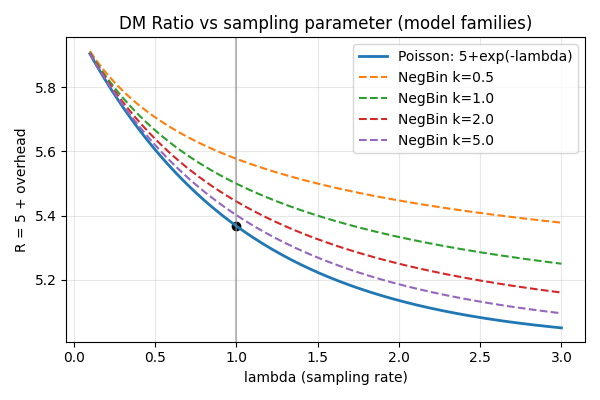
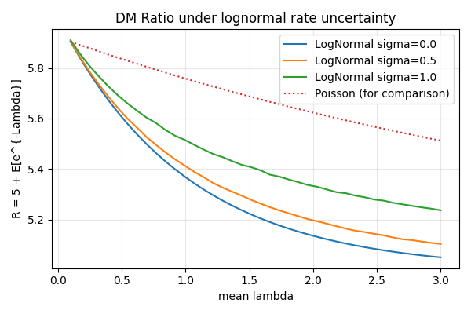

% DM ratio sensitivity — quick draft
% Author: BrocaOS (draft)
% Date: 2025-12-25

# Abstract
A quick summary and initial figures comparing Poisson, negative-binomial, and lognormal-rate uncertainty models on the predicted L-ToEC DM ratio.

# Methods
We compare the quantity R = 5 + E[e^{-Lambda}] under several models for Lambda: Poisson (fixed lambda), Negative Binomial overdispersion (k), and lognormal uncertainty in rate (sigma).

# Results

Summary numbers (lambda=1, from report):

- Planck observed ratio: 5.364327223961
- Poisson (lambda=1): 5.367879441171
- NegBin k=0.5: 5.577350269190
- NegBin k=1.0: 5.500000000000
- LogNormal sigma=0.5: 5.410380471352

# Discussion
This quick draft highlights the potential sensitivity of R to overdispersion and heavy-tailed rate uncertainty. Further work: expand parameter sweeps and include analytic approximations.
